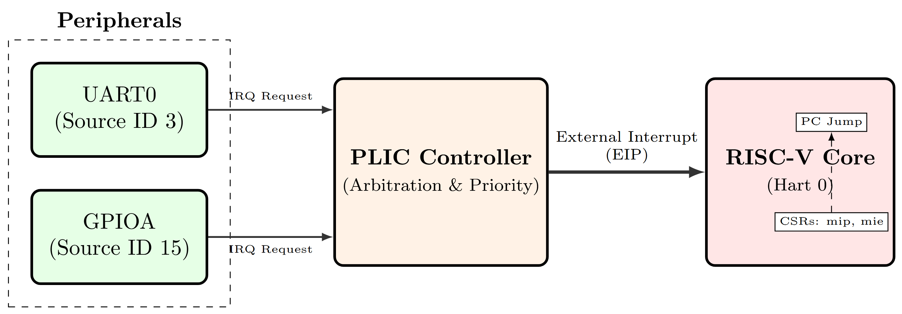
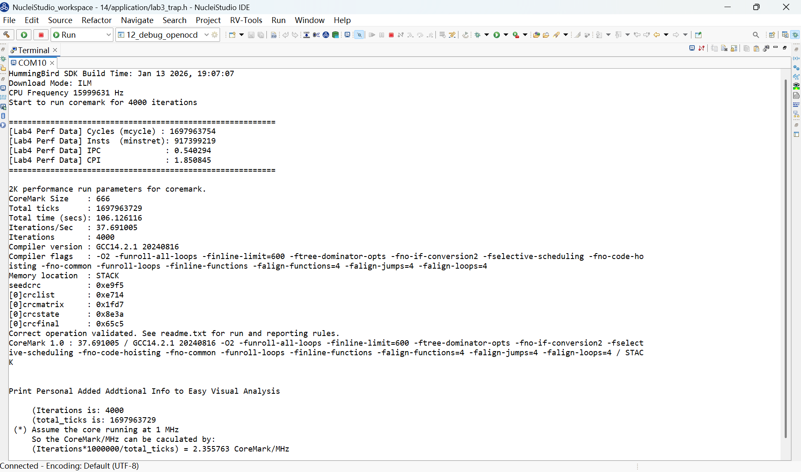
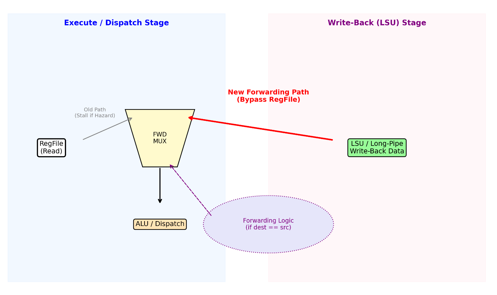

<p align="center">
  <h1 align="center">RISC-V Computer Architecture Labs</h1>
  <p align="center">
    A progressive, bare-metal exploration of the RISC-V ISA — from assembly fundamentals to RTL-level pipeline optimization on real FPGA hardware.
  </p>
</p>

<p align="center">
  
  
  
  
  
  
  
</p>

<p align="center">
  <a href="README_CN.md"><strong>[ 中文版 README ]</strong></a>
</p>

---

## Highlights

- **Full-Stack Depth**: From C/Assembly mixed programming down to Verilog RTL modifications on a real FPGA — no simulators, no shortcuts.
- **Quantitative Rigor**: Every design decision backed by cycle-accurate measurements via `mcycle`/`minstret` CSRs.
- **Progressive Complexity**: Four labs forming a coherent arc — assembly → MMIO drivers → interrupt systems → pipeline optimization.
- **RTL-Level Optimization**: Data forwarding bypass logic added to `e203_exu.v`, eliminating Load-Use stalls in the E203 pipeline.

---

## Hardware Platform

| Component | Specification |
|-----------|--------------|
| **FPGA** | Xilinx XC7A200T (Nuclei DDR200T Board) |
| **Processor** | HBirdv2 E203 — 2-stage pipeline, RV32IMAC |
| **Clock** | 16 MHz |
| **Memory** | ITCM 64 KB / DTCM 16 KB |
| **Peripherals** | GPIO (6 LEDs + 6 Switches), UART 115200-8N1 |
| **Debug** | JTAG (OpenOCD) |

<!-- Architecture diagram placeholder -->
<!--  -->

---

## Lab Overview & Key Metrics

| Lab | Topic | Core Technique | Key Metric |
|-----|-------|---------------|------------|
| **Lab 1** | C/Assembly Interop | RISC-V calling convention, register-level debugging | `sum_to_n` verified via `a0` return |
| **Lab 2** | Bare-Metal MMIO | GPIO 3-step init, RMW-safe LED control, UART polling | 6-bit switch↔LED linkage |
| **Lab 3** | Interrupt Hierarchy | Polling → MSI Trap → PLIC Interrupt-Driven | Latency: 28 → 59 cycles; CPU idle: 1% → 99% |
| **Lab 4** | Pipeline Optimization | CoreMark instrumentation, RTL data forwarding | **CPI = 1.915, Score = 36.436** |

---

## Lab 1 — Assembly Programming

**Objective**: Implement `sum_to_n(n) = 1 + 2 + ... + n` in RISC-V assembly, called from C.

**Key Implementation** (`Sum.S`):
```asm
sum_to_n:
    li   t0, 0          # accumulator = 0
    li   t1, 1          # counter = 1
loop:
    add  t0, t0, t1     # accumulator += counter
    addi t1, t1, 1      # counter++
    bgt  a0, t1, loop   # if n > counter, continue  (modified: bge for n >= counter)
    add  a0, t0, x0     # return value in a0
    ret
```

> **Calling Convention**: Argument in `a0`, return in `a0`. Callee uses only temporary registers (`t0`–`t1`) — no stack frame needed.

---

## Lab 2 — MMIO & GPIO/UART Drivers

**Objective**: Write bare-metal drivers for GPIO and UART using direct Memory-Mapped I/O.

### MMIO Register Map

| Register | Address | Function |
|----------|---------|----------|
| `GPIOA_PADDIR` | `0x10012000` | Pin direction (1 = output) |
| `GPIOA_PADIN`  | `0x10012004` | Input value read |
| `GPIOA_PADOUT` | `0x10012008` | Output value write |
| `GPIOA_IOFCFG` | `0x1001201C` | I/O function config |
| `UART0_THR/RBR`| `0x10013000` | TX hold / RX buffer |
| `UART0_LSR`    | `0x10013014` | Line status (TX empty / RX ready) |

### GPIO Pin Mapping

```
Bit:   31  30  29  28  27  26  25  24  23  22  21  20
Func:  SW5 SW4 SW3 SW2 SW1 SW0 LED5 LED4 LED3 LED2 LED1 LED0
```

### Critical 3-Step GPIO Initialization

```c
// 1. Clear IOF — release pins from hardware functions
REG32(GPIOA_IOFCFG) &= ~(LED_MASK | SW_MASK);
// 2. Set direction — LEDs as output, switches as input
REG32(GPIOA_PADDIR) |= LED_MASK;
REG32(GPIOA_PADDIR) &= ~SW_MASK;
// 3. Initialize output — all LEDs OFF (active-low)
REG32(GPIOA_PADOUT) |= LED_MASK;
```

> **Design Pattern**: All GPIO writes use Read-Modify-Write (RMW) to preserve adjacent pin states — essential on shared MMIO registers.

---

## Lab 3 — Interrupt Hierarchy: From Polling to Interrupt-Driven

This lab progressively builds an interrupt system across three tasks, quantifying the fundamental tradeoff between **response latency** and **CPU utilization**.

### Task 1 — Polling Mode

Tight-loop GPIO polling with cycle-accurate measurement via `mcycle` CSR.

**Measured Performance**:

| Metric | Value |
|--------|-------|
| Poll loop body | **56 cycles** |
| Average response latency | **28 cycles** (= 56/2) |
| CPU utilization on polling | **99%** |
| Useful work capacity | **~1%** |

### Task 2 — Trap Framework (MSI)

Assembly-level trap entry (`lab3_trap_entry.S`) saving 16 caller-saved registers on a 64-byte stack frame:

```
┌─────────────────────────────────────┐
│         Trap Entry Sequence         │
├─────────────────────────────────────┤
│ 1. addi sp, sp, -64                │  ← Allocate 64B frame
│ 2. sw ra/t0–t6/a0–a7 → [sp]       │  ← Save 16 registers
│ 3. csrr a0, mcause                 │  ← Read trap cause
│ 4. csrr a1, mepc                   │  ← Read exception PC
│ 5. csrr a2, mtval                  │  ← Read trap value
│ 6. call lab3_trap_handler          │  ← Dispatch to C handler
│ 7. lw ra/t0–t6/a0–a7 ← [sp]      │  ← Restore 16 registers
│ 8. addi sp, sp, 64                 │  ← Deallocate frame
│ 9. mret                            │  ← Return from trap
└─────────────────────────────────────┘
```

**CSR Configuration Chain**:
```
mtvec  ← &lab3_trap_entry     // Trap vector base address
mie    |= MIE_MSIE            // Enable Machine Software Interrupt
mstatus |= MSTATUS_MIE        // Global interrupt enable
```

### Task 3 — Full Interrupt-Driven System (PLIC + UART RX)

**Measured Performance**:

| Metric | Value |
|--------|-------|
| ISR execution time | **93–178 cycles** |
| Interrupt latency (hardware + entry) | **59–60 cycles (~3.7 μs @ 16 MHz)** |
| CPU idle ratio | **>99%** |

### Latency Model: Polling vs. Interrupt-Driven

The fundamental latency model for each paradigm:

**Polling**:

$$L_{\text{poll}} = \frac{T_{\text{loop}}}{2} = \frac{56}{2} = 28 \text{ cycles}$$

$$\eta_{\text{CPU}} = \frac{T_{\text{useful}}}{T_{\text{total}}} \approx 1\%$$

**Interrupt-Driven**:

$$L_{\text{int}} = T_{\text{hw\_latch}} + T_{\text{context\_save}} + T_{\text{dispatch}} \approx 59 \text{ cycles}$$

$$\eta_{\text{CPU}} = 1 - \frac{N_{\text{events}} \cdot T_{\text{ISR}}}{T_{\text{total}}} > 99\%$$

### Comparative Summary

| Dimension | Polling | Interrupt-Driven | Winner |
|-----------|---------|-------------------|--------|
| Response Latency | **28 cycles (1.75 μs)** | 59 cycles (3.69 μs) | Polling |
| CPU Utilization | 1% useful | **>99% useful** | Interrupt |
| Scalability | O(n) with device count | **O(1) amortized** | Interrupt |
| Power Efficiency | Constant full-speed | **Event-driven, can WFI** | Interrupt |
| Code Complexity | Simple loop | ISR + CSR + context save | Polling |

> **Key Insight**: Polling wins on raw latency (28 vs. 59 cycles) but is fundamentally unscalable. The interrupt-driven model frees **98%+ CPU cycles** for computation — a 50× throughput gain in multi-task scenarios, at the cost of only 2.1× latency increase.

---

## Lab 4 — CoreMark & Pipeline Optimization

### Phase A — Baseline

| Parameter | Value |
|-----------|-------|
| CoreMark Score | **36.436** |
| CoreMark/MHz | **2.277** |
| Iterations | 4000 |
| Runtime | >10 s |

### Phase B — Instrumentation

Performance counters read via inline assembly (`csrr` on `mcycle`/`minstret`):

| Counter | Value |
|---------|-------|
| Total Cycles | 1,756,951,756 |
| Total Instructions | 917,399,219 |
| **CPI** | **1.915** |
| **IPC** | **0.522** |

$$\text{CPI} = \frac{\text{Cycles}}{\text{Instructions}} = \frac{1{,}756{,}951{,}756}{917{,}399{,}219} = 1.915$$

> **Analysis**: CPI = 1.915 indicates that on average each instruction takes nearly 2 cycles — the ideal for a 2-stage pipeline is CPI = 1.0. The gap of 0.915 cycles/instruction is dominated by pipeline stalls.

### Phase C — Bottleneck Identification

5 independent runs confirmed deterministic execution (σ = 0) on bare-metal FPGA. Stall sources ranked by impact:

| Hazard Type | Mechanism | Estimated Impact |
|-------------|-----------|-----------------|
| **Load-Use (RAW)** | `lw rd, ...` followed by ALU using `rd` — 1-cycle stall | **Primary** (~60%) |
| **Control (Branch)** | Branch target unknown until EXE — 1-cycle flush | Secondary (~25%) |
| **Long-Latency ALU** | MUL/DIV multi-cycle execution → pipeline stall | Tertiary (~15%) |

### Phase D — RTL Optimization: Data Forwarding in `e203_exu.v`

The core optimization: **bypass the register file** by forwarding the Load-Store Unit (LSU) write-back data directly to the dispatch stage, eliminating Load-Use stalls.

#### Forwarding Logic (Verilog)

```verilog
// ─── Load-Use Data Forwarding (e203_exu.v, lines 309-335) ───

// 1. Forwarding enable: WB valid ∧ dest matches source ∧ dest ≠ x0 ∧ integer reg
wire fwd_rs1_en = longp_wbck_o_valid
                & (longp_wbck_o_rdidx == i_rs1idx)
                & (|longp_wbck_o_rdidx)
                & (~longp_wbck_o_rdfpu);

wire fwd_rs2_en = longp_wbck_o_valid
                & (longp_wbck_o_rdidx == i_rs2idx)
                & (|longp_wbck_o_rdidx)
                & (~longp_wbck_o_rdfpu);

// 2. MUX: select forwarded data or register file data
wire [`E203_XLEN-1:0] disp_fwd_rs1 = fwd_rs1_en ? longp_wbck_o_wdat[`E203_XLEN-1:0] : rf_rs1;
wire [`E203_XLEN-1:0] disp_fwd_rs2 = fwd_rs2_en ? longp_wbck_o_wdat[`E203_XLEN-1:0] : rf_rs2;

// 3. Suppress stall when forwarding resolves the dependency
wire disp_no_stall_rs1 = oitfrd_match_disprs1 & (~fwd_rs1_en);
wire disp_no_stall_rs2 = oitfrd_match_disprs2 & (~fwd_rs2_en);
```

#### Pipeline Diagram: Before vs. After Forwarding

```
Without Forwarding (Load-Use Stall):
  Cycle:    1       2       3       4       5
  lw x5    [IF]    [EX]    [WB]
  add x6   -----   [IF]   <STALL>  [EX]    [WB]
                           ↑ stall: x5 not yet in RF

With Forwarding (Bypass):
  Cycle:    1       2       3       4
  lw x5    [IF]    [EX]    [WB]
  add x6   -----   [IF]  ──[EX]──  [WB]
                           ↑ x5 forwarded from WB → EX
```

#### Forwarding Conditions (Boolean Logic)

$$\text{fwd\_en} = V_{\text{wb}} \wedge (R_{\text{dst}} = R_{\text{src}}) \wedge (R_{\text{dst}} \neq \texttt{x0}) \wedge \neg F_{\text{fpu}}$$

Where:
- $V_{\text{wb}}$: Write-back stage has valid data
- $R_{\text{dst}} = R_{\text{src}}$: Destination register matches the source operand
- $R_{\text{dst}} \neq \texttt{x0}$: Exclude hardwired zero register
- $\neg F_{\text{fpu}}$: Integer register (not floating-point)

> **Result**: The forwarding path converts Load-Use stalls from a mandatory 1-cycle penalty into a zero-cycle bypass, directly improving CPI toward the theoretical minimum of 1.0.

### Compiler Optimization Flags

```
-O2 -funroll-all-loops -finline-limit=600
-ftree-dominator-opts -fno-if-conversion2
-finline-functions -falign-functions=4
-falign-jumps=4 -falign-loops=4
```

<!-- CoreMark terminal output screenshot placeholder -->
<!--  -->

<!-- Pipeline forwarding schematic placeholder -->
<!--  -->

---

## Project Structure

```
RISC-V-Computer-Architecture-Labs/
├── Lab1-Assembly/                          # Lab 1: C/Assembly interop
│   └── src/
│       ├── main.c                          #   C entry point
│       └── Sum.S                           #   RISC-V assembly (sum_to_n)
├── Lab2-MMIO/                              # Lab 2: Bare-metal MMIO drivers
│   └── src/
│       ├── main.c                          #   GPIO & UART driver
│       └── lab2_mmio.h                     #   Register map definitions
├── Lab3-Interrupts/                        # Lab 3: Interrupt system
│   ├── Task1-Polling/src/                  #   T1: GPIO polling + cycle counting
│   ├── Task2-TrapFramework/src/            #   T2: MSI trap with asm entry
│   └── Task3-InterruptDriven/src/          #   T3: PLIC + UART RX + perf stats
│       ├── lab3_main.c                     #     Interactive command interface
│       ├── lab3_trap.c / .h                #     C trap handlers
│       ├── lab3_trap_entry.S               #     Assembly trap entry
│       ├── lab3_stats.c / .h               #     Performance statistics
│       └── lab3_timer.c / .h               #     Timer utilities
├── Lab4-CoreMark/                          # Lab 4: CoreMark & RTL optimization
│   ├── src/                                #   EEMBC CoreMark suite
│   │   ├── core_main.c                     #     Benchmark driver
│   │   ├── core_list_join.c                #     Linked list workload
│   │   ├── core_matrix.c                   #     Matrix workload
│   │   ├── core_state.c                    #     State machine workload
│   │   └── core_portme.c / .h              #     Platform porting layer
│   └── rtl/                                #   Verilog RTL modifications
│       ├── e203_exu.v                      #     ★ Execution unit (forwarding logic)
│       └── config.v                        #     Processor configuration
├── docs/                                   # Detailed per-lab documentation (8 files)
├── reports/
│   ├── Lab1~4-实验报告.pdf                  # Final experiment reports
│   ├── guides/                             # Lab guidance documents
│   ├── diagrams/                           # Architecture diagrams & screenshots
│   │   ├── Lab1/ Lab2/ Lab3/ Lab4/         #   Per-lab visual assets
│   └── drafts/                             # Report drafts
├── references/                             # Reference materials
├── README.md                               # This file (English)
└── README_CN.md                            # Chinese version (中文版)
```

---

## Build & Run

### Prerequisites

- [Nuclei Studio IDE](https://nucleisys.com/download.php) (Eclipse-based)
- RISC-V GCC Toolchain (bundled with Nuclei Studio)
- Nuclei DDR200T FPGA Board + JTAG Debugger
- [HBird SDK](https://github.com/riscv-mcu/hbird-sdk) — NMSIS Core headers & SoC support

### Build Steps

```bash
# 1. Import project into Nuclei Studio
# 2. Select target memory: ILM (recommended for debug) or Flash
# 3. Build → GCC RISC-V cross-compilation
# 4. Flash via JTAG
# 5. Open serial terminal: 115200 baud, 8N1
```

For Lab 4 RTL modification:
1. Replace `e203_exu.v` in the HBirdv2 SoC RTL source
2. Enable `E203_CFG_SUPPORT_LSU_FWD` in `config.v`
3. Re-synthesize bitstream and program FPGA

---

## Technologies & Concepts

| Category | Details |
|----------|---------|
| **ISA** | RISC-V RV32IMAC (Integer, Multiply, Atomic, Compressed) |
| **Languages** | C, RISC-V Assembly (GAS syntax), Verilog HDL |
| **Hardware** | MMIO, GPIO, UART, JTAG |
| **Interrupt** | CLINT (MSI/MTI), PLIC (external interrupts), CSR-based trap handling |
| **Pipeline** | 2-stage (IF/EX+WB), Load-Use hazard, data forwarding bypass |
| **Benchmarking** | EEMBC CoreMark, `mcycle`/`minstret` CSR instrumentation |

---

## License

This project is for educational purposes. CoreMark is a registered trademark of [EEMBC](https://www.eembc.org/coremark/).
